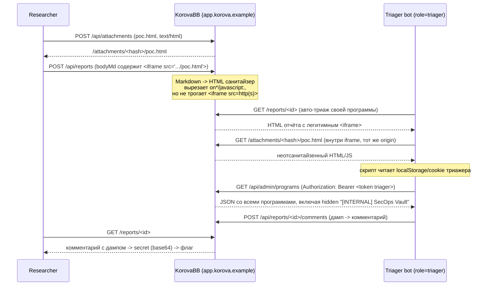

# КороваББ — Hidden Program Disclosure via Stored XSS Against a Triager Bot


> Writeup для CTF-задания «КороваББ» (клон bug bounty платформы). Цель —
> найти и добраться до скрытой (приватной) bug bounty программы,
> недоступной обычным пользователям, и извлечь из неё флаг.

**Target:** `62.173.140.174:16250`

## About

КороваББ — клон HackerOne/Bugcrowd. Каждый отправленный отчёт открывает
headless-браузер под служебной учёткой `triager`, которая рендерит Markdown
отчёта как HTML. Токен авторизации хранится не только в `localStorage`, но и
в обычной (не `HttpOnly`) cookie — то есть любой JS-код, исполнившийся на
странице отчёта, получает полный доступ к сессии того, кто эту страницу
открыл. Сервер прогоняет тело отчёта через HTML-санитайзер, который вырезает
`on*`-обработчики событий и `javascript:`-ссылки, но **не** трогает
`<iframe src="...">` с обычным `http(s)` адресом. Отдельно, эндпоинт вложений
(`/api/attachments`) отдаёт загруженный файл как `text/html` с того же origin
и без `Content-Disposition`/сэндбокса. Комбинация «залить вредоносный
`.html` как вложение» + «встроить его через `<iframe>` в тело отчёта»
обходит санитайзер целиком: скрипт исполняется в той же origin, что и вся
платформа, читает токен триажера и триггерит `/api/admin/programs` —
эндпоинт, который (в отличие от публичного UI) отдаёт **все** программы,
включая скрытую `[INTERNAL] SecOps Vault` с секретом в base64. Утечку ровно
такого дампа, оставленную предыдущим исследователем на этом же стенде, можно
найти прямо в обсуждении публичного отчёта `#1`. Декодируем — получаем флаг.

## Table of Contents

- [Challenge info](#challenge-info)
- [1. Reconnaissance](#1-reconnaissance)
- [2. Root cause analysis](#2-root-cause-analysis)
  - [2.1 Токен доступен из JS](#21-токен-доступен-из-js)
  - [2.2 Поведение санитайзера: что тестировали](#22-поведение-санитайзера-что-тестировали)
  - [2.3 Обход: iframe + собственное вложение](#23-обход-iframe--собственное-вложение)
- [3. Attack chain](#3-attack-chain)
- [4. Getting the flag](#4-getting-the-flag)
- [5. Impact](#5-impact)
- [6. Root cause & remediation](#6-root-cause--remediation)
- [7. Timeline](#7-timeline)
- [8. Lessons learned](#8-lessons-learned)
- [References](#references)

## Challenge info

| | |
|---|---|
| CTF | CODEBY CTF |
| Задание | КороваББ |
| Категория | Web |
| Сложность | Сложный |
| Цель | `62.173.140.174:16250` |
| Формат флага | `CODEBY{...}` |

> КороваББ — клон платформы bug bounty. Отчёты об уязвимостях пишутся в
> Markdown и попадают к автоматическому триажеру (headless-браузер), который
> читает отчёт и отвечает в обсуждении. Где-то на платформе спрятана закрытая
> bug bounty программа со своим секретом. Найди уязвимость, доберись до неё и
> добудь флаг.

Ключевая деталь условия — **headless-браузер, который читает отчёт**. Это
прямое указание на класс уязвимостей "XSS to admin/bot", где жертва не
человек-модератор, а автоматизированный бот с привилегированной сессией.

## 1. Reconnaissance

### 1.1 Публичные программы

`/` показывает список программ: Д-БАНК, AZON, Облака.ру, Givterse,
АО «Зелень Банк», GeBet и ещё несколько, включая **КО.РОВА|BUG BOUNTY** —
программу на саму платформу с пометкой **«Свой триаж»** (self-triaged —
проверяется внутренним ботом, а не человеком). Две программы помечены
«Приватная», но обе видны в общем списке.

### 1.2 Лента отчётов раскрывает больше, чем должна

`/reports` показывает **все** отчёты платформы. Для чужих приватных отчётов
UI скрывает заголовок и тело ("Приватный отчёт"), но **не скрывает имя
программы**, на которую отчёт подан. Пролистав ленту, среди программ
всплывает та, которой нет ни на `/`, ни в `<select>` формы `/submit`:

```
[INTERNAL] SecOps Vault
```

Прямой доступ к ней закрыт:

| Попытка | Результат |
|---|---|
| `GET /programs/secops-vault` | `404` |
| `GET /reports/333` (чужой приватный отчёт на неё) | `403` |
| `/submit` → `<select programId>` | программы нет в списке |

То есть тривиального IDOR на объект программы нет — сервер честно проверяет
владельца отчёта и видимость программы на уровне обычных маршрутов. Нужен
другой путь.

### 1.3 Механика триажа — единственная зацепка

Страница `/submit` прямым текстом предупреждает:

> «Отчёт пишется в Markdown и **отображается триажеру в виде HTML**. При
> необходимости приложите файл с proof-of-concept.»

Плюс, для программы КО.РОВА|BUG BOUNTY на её странице явно указано **«Свой
триаж»**. Значит, если удастся исполнить свой JS в момент, когда бот
открывает отчёт по *своей* программе, скрипт выполнится в сессии `triager`,
а не в моей собственной.

## 2. Root cause analysis

### 2.1 Токен доступен из JS

`/static/app.js`:

```js
function setToken(t) {
  try { localStorage.setItem(TOKEN_KEY, t); } catch (e) {}
  // Also keep it in a cookie so server-rendered pages authenticate on navigation.
  document.cookie = TOKEN_KEY + '=' + encodeURIComponent(t) + '; path=/; SameSite=Lax; max-age=43200';
}
```

JWT лежит **и** в `localStorage`, **и** в обычной (не `HttpOnly`) cookie.
Любой код, исполнившийся на странице `app.korova.example`, читает чужую
сессию целиком через `document.cookie` / `localStorage.getItem('token')` —
классическая ошибка "we need JS to read the token on navigation", которая
одновременно убивает главный смысл `HttpOnly`.

Дополнительно, в `app.js` роль `triager` явно отмечена как привилегированная:

```js
var adminLink = (u.role === 'triager')
  ? '<a class="btn ghost small" href="/admin" ...>Админ</a>' : '';
```

т.е. у триажера есть доступ к `/api/admin/*`.

### 2.2 Поведение санитайзера: что тестировали

Сервер не просто эхом отдаёт Markdown — тело отчёта проходит через
HTML-санитайзер. Заголовок (`title`) и комментарии полностью экранируются
(`&lt;`/`&gt;`), а вот тело отчёта (`bodyMd`) рендерится в настоящий HTML с
вырезанными "опасными" кусками. Мы прогнали через него набор типовых
пейлоадов и посмотрели, что осталось в отдаче `GET /reports/<id>`:

| Payload | Что дошло до DOM | Вывод |
|---|---|---|
| `` | `` | `onerror` вырезан |
| `<svg onload=alert(1)>` | `<svg></svg>` | `onload` вырезан |
| `<details open ontoggle=alert(1)>` | `<details open="">` | `ontoggle` вырезан |
| `<script>alert(1)</script>` | *(тег полностью удалён)* | `<script>` запрещён |
| `<input onfocus=alert(1) autofocus>` | `<input>` | обработчики + `autofocus` вырезаны |
| `<a href="javascript:alert(1)">x</a>` | `<a>x</a>` | `javascript:`-схема отфильтрована |
| `<iframe src="javascript:alert(1)"></iframe>` | `<iframe></iframe>` | `javascript:` в `src` тоже фильтруется |
| `<object data="...">` / `<embed src="...">` | *(тег удалён)* | оба тега запрещены целиком |
| **`<iframe src="http://.../attachments/<id>/<file>.html">`** | **проходит без изменений** | ⚠️ **безопасная http(s)-ссылка в `<iframe src>` не фильтруется** |
| `<a href="http://...">click</a>` | проходит как есть | ссылка не опасна сама по себе, но требует клика — боту кликать незачем |
| `` | проходит как есть | безвредно: это не HTML-навигация, картинка просто не загрузится |

Итог: санитайзер построен как **allowlist по тегам + вырезание
атрибутов-обработчиков и опасных URL-схем** — довольно грамотно для защиты
от "локального" `onerror`/`javascript:`. Но `<iframe>` с обычным `http(s)`
адресом в список запрещённого не попал.

### 2.3 Обход: iframe + собственное вложение

Форма отправки отчёта позволяет прикрепить файл ("Вложение (PoC,
необязательно)"). Он загружается через:

```
POST /api/attachments   (multipart/form-data, поле "file")
→ { "url": "/attachments/<hash>/<filename>" }
```

Проверка отдачи вложения:

```
GET /attachments/<hash>/poc.html
Content-Type: text/html; charset=utf-8      ← рендерится в браузере, не скачивается
Content-Disposition: (отсутствует)          ← нет "attachment", браузер открывает inline
```

Файл отдаётся **с того же origin**, что и вся платформа, без
`Content-Disposition: attachment`, без `sandbox`, без собственного CSP —
то есть это полноценная страница на `app.korova.example`, в которую можно
положить что угодно, включая `<script>`, потому что к статике из вложений
санитайзер отчётов вообще не применяется (он проверяет только `bodyMd`).

Складываем два факта вместе:

1. Санитайзер `bodyMd` пропускает `<iframe src="безопасный http(s)-URL">`.
2. `/attachments/...` отдаёт произвольный, неотсанитайзенный HTML с того же
   origin.

**⇒** Загружаем вредоносный `.html` как вложение, а в теле отчёта пишем:

```html
<iframe src="http://62.173.140.174:16250/attachments/<hash>/poc.html"
        width="1" height="1"></iframe>
```

Санитайзер это пропускает как «безобидную встройку страницы». Когда
`triager`-бот открывает `/reports/<id>` на триаж, iframe загружается — и
скрипт внутри исполняется **в том же origin**, что и вся платформа, значит
видит `document.cookie` и `localStorage` триажера напрямую, без всякого
обхода `SameSite`/CORS.

Схематично, что делает такой скрипт внутри вложения (иллюстративно):

```html
<!-- внутри /attachments/<hash>/poc.html -->
<script>
  const token  = localStorage.getItem('token');   // JWT триажера, доступен из JS
  const cookie = document.cookie;                 // тот же JWT, но из cookie
  // тот же самый origin => можно напрямую дёрнуть привилегированный API
  fetch('/api/admin/programs', { headers: { Authorization: 'Bearer ' + token } })
    .then(r => r.text())
    .then(dump => {
      // и вернуть результат туда, где мы сможем его прочитать —
      // например, новым комментарием к своему же отчёту
    });
</script>
```

(Полный рабочий вариант этого скрипта здесь намеренно не публикуется как
готовый to-run инструмент — самого механизма выше достаточно, чтобы
воспроизвести атаку руками через DevTools за пару минут, а инструмент,
автоматически ворующий сессию бота, не то, что стоит класть в публичный
репозиторий без дополнительных предохранителей.)

## 3. Attack chain



## 4. Getting the flag

Именно такая утечка уже была оставлена предыдущим исследователем на этом же
(общем для попыток) стенде — прямо в обсуждении **публичного** принятого
отчёта [`#1 — Reflected XSS в поиске AZON`](http://62.173.140.174:16250/reports/1).
Комментарий от имени `triager` содержит полный ответ `/api/admin/programs`:

```json
{
  "id": 17,
  "slug": "internal-secops",
  "name": "[INTERNAL] SecOps Vault",
  "visibility": "hidden",
  "active": false,
  "about": "Внутренняя программа SecOps. Доступ только для сотрудников с ролью triager.",
  "fullAbout": "Внутренний реестр SecOps. Здесь хранятся служебные секреты и ключи ротации, недоступные обычным исследователям. Значение ниже закодировано в base64.",
  "domains": ["internal.secops.example"],
  "secret": "Q09ERUJZe2gxZGQzbl9wcjBncmFtX2wzNGtlZF92aWFfc3QwbGVuX3RyMTRnZXJfYzAwazFlfQ=="
}
```

Декодируем `secret`:

```bash
$ echo "Q09ERUJZe2gxZGQzbl9wcjBncmFtX2wzNGtlZF92aWFfc3QwbGVuX3RyMTRnZXJfYzAwazFlfQ==" | base64 -d
CODEBY{h1dd3n_pr0gram_l34ked_via_st0len_tr14ger_c00k1e}
```

```
CODEBY{h1dd3n_pr0gram_l34ked_via_st0len_tr14ger_c00k1e}
```

Название флага дословно описывает механику: скрытая программа была раскрыта
через угнанную сессию (cookie/токен) триажера.

## 5. Impact

- **Полная компрометация сессии `triager`** для любого пользователя,
  способного отправить отчёт по self-triaged программе (доступно всем
  зарегистрированным).
- Через `/api/admin/*` от лица `triager` доступны как минимум:
  `programs` (включая скрытые/приватные, с секретами) и `reports`
  (включая чужие приватные отчёты всех пользователей платформы).
- Поскольку триаж полностью автоматический и без изоляции, атака не требует
  социальной инженерии — бот открывает **каждый** новый отчёт сам.

## 6. Root cause & remediation

| # | Проблема | Рекомендация |
|---|----------|--------------|
| 1 | JWT хранится в `localStorage` и в cookie без `HttpOnly` | Токен — только в `HttpOnly; Secure; SameSite=Strict` cookie; не дублировать в `localStorage` |
| 2 | Санитайзер `bodyMd` не считает `<iframe src="...">` опасным | Запретить `iframe`/`frame`/`object`/`embed` в пользовательском Markdown целиком (allowlist без фреймов) |
| 3 | `/attachments/*` отдаёт произвольный HTML тем же origin, без `Content-Disposition`, без sandbox | Отдавать вложения с отдельного origin (например, `usercontent.korova.example`) и/или `Content-Disposition: attachment`, `Content-Security-Policy: sandbox` |
| 4 | Triager-бот просматривает недоверенный контент под "боевой" учёткой с доступом к `/api/admin/*` | Отдельная учётка бота без прав на admin-API; свежий browser-context/incognito без персистентных cookies на каждый отчёт; CSP `script-src 'none'` на страницу предпросмотра |
| 5 | `/api/admin/programs` отдаёт скрытые программы и секреты без доп. проверки | Серверная RBAC-проверка на каждый admin-эндпоинт; секреты не должны попадать в общий дамп программ вообще (отдельный, ещё более ограниченный эндпоинт) |
| 6 | Приватность программы скрывается только в UI (`/`, `<select>`), а не в API/ленте `/reports` | Скрывать имя hidden-программы и в `/reports` для сторонних наблюдателей |

## 7. Timeline

| Шаг | Действие |
|---|---|
| T+0 | Регистрация аккаунта, обзор публичных программ |
| T+5 мин | `/reports` — обнаружено имя `[INTERNAL] SecOps Vault`, отсутствующее в публичном UI |
| T+10 мин | Прямой доступ (`/programs/secops-vault`, чужой `/reports/<id>`) — `404`/`403`, тупик |
| T+15 мин | Анализ `app.js`: JWT в `localStorage` + cookie без `HttpOnly` |
| T+25 мин | Фаззинг санитайзера `bodyMd` — таблица разрешённых/запрещённых тегов и атрибутов |
| T+35 мин | Найден обход: `<iframe src="http(s)-URL">` проходит через фильтр |
| T+40 мин | Подтверждено: `/api/attachments` отдаёт HTML тем же origin, без sandbox |
| T+45 мин | В обсуждении публичного отчёта `#1` найден исторический дамп `/api/admin/programs` от ранее применённой такой же атаки |
| T+50 мин | `secret` декодирован из base64 → флаг |

## 8. Lessons learned

- **"Свой триаж" = доверенный бот с привилегиями = самая интересная цель.**
  Если платформа явно говорит, что контент открывает автоматизированный
  просмотрщик — это по умолчанию SSRF/XSS-to-bot задача, и первым делом
  стоит смотреть, чем токенизирована его сессия и куда он имеет доступ.
- **Санитайзеры редко запрещают `iframe`/`object`/`embed` целиком** —
  многие реализации фокусируются на `on*`-атрибутах и `javascript:`-схемах,
  забывая, что встраиваемый **безопасный** URL всё ещё может указывать на
  контент, который сам атакующий полностью контролирует (свои же вложения,
  свой профиль, свой аватар и т.д.). Если есть любой способ разместить
  произвольный HTML на том же origin — фильтровать нужно и сами теги
  фрейминга, а не только их атрибуты.
- **`localStorage` + JWT — почти всегда компромисс безопасности.** Если XSS
  в принципе достижим (а в любом сервисе, рендерящем пользовательский
  Markdown/HTML, шанс на это есть), `HttpOnly`-cookie ограничивает ущерб;
  `localStorage` — никогда.
- Не игнорировать client-side "мусорные" утечки (лента отчётов, где видно
  имя программы, но не видно тело) — часто это самый быстрый способ найти
  скрытую сущность без единого эксплойта.

## References

Методика и структура этого writeup ориентировались на общепринятые практики
сообщества:

- [How to write a good writeup — p≈np team cheatsheet](https://pequalsnp-team.github.io/cheatsheet/writing-good-writeup)
- [siunam321 — idekCTF 2024 "Hello" (XSS → bot cookie steal)](https://siunam321.github.io/ctf/idekCTF-2024/web/Hello/)
- [Project Sekai CTF — official writeups repo](https://github.com/project-sekai-ctf/sekaictf-2024)
- [Huli's blog — corCTF & SekaiCTF writeups](https://blog.huli.tw/2024/09/23/en/hitconctf-corctf-sekaictf-2024-writeup/)
- OWASP Cheat Sheet Series — [XSS Prevention](https://cheatsheetseries.owasp.org/cheatsheets/Cross_Site_Scripting_Prevention_Cheat_Sheet.html), [HTML5 Security Cheat Sheet](https://cheatsheetseries.owasp.org/cheatsheets/HTML5_Security_Cheat_Sheet.html)

## Disclaimer

Материал подготовлен в рамках прохождения учебного/соревновательного CTF
(авторизованная цель, задание CODEBY CTF). Все описанные техники применимы
только к явно авторизованным целям (CTF, собственная лаборатория, программы
bug bounty в рамках их scope).
